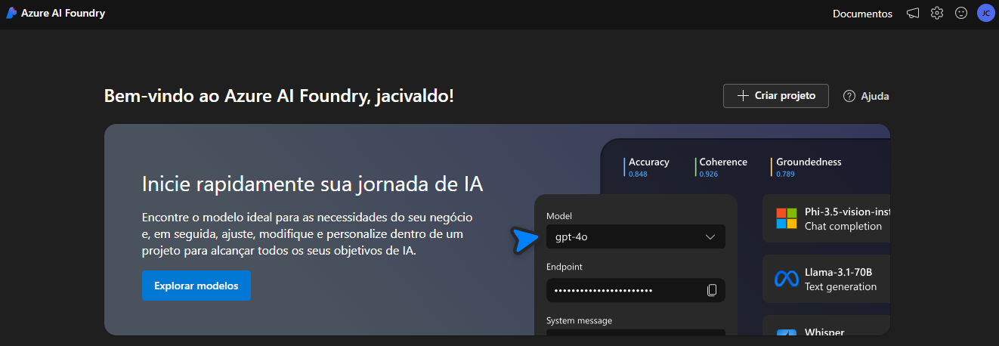
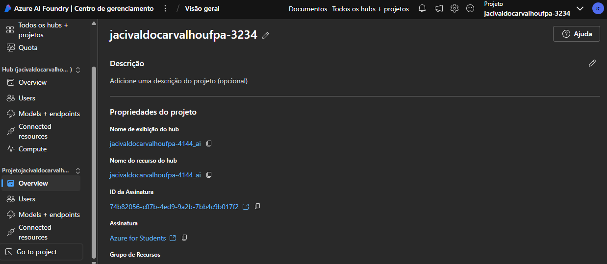
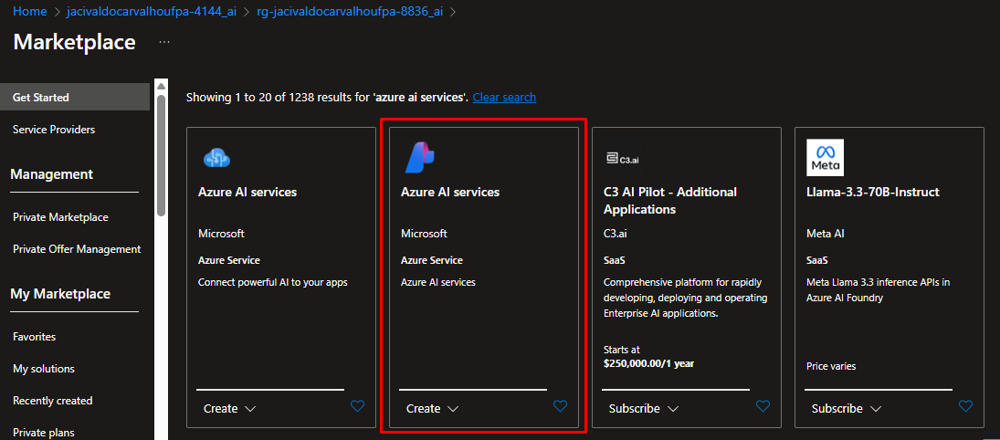
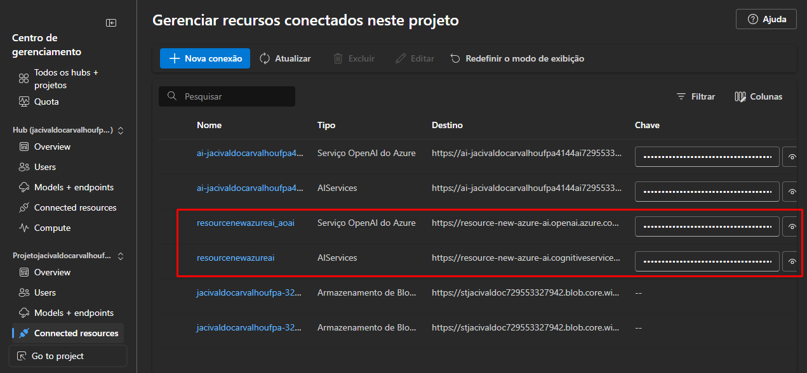
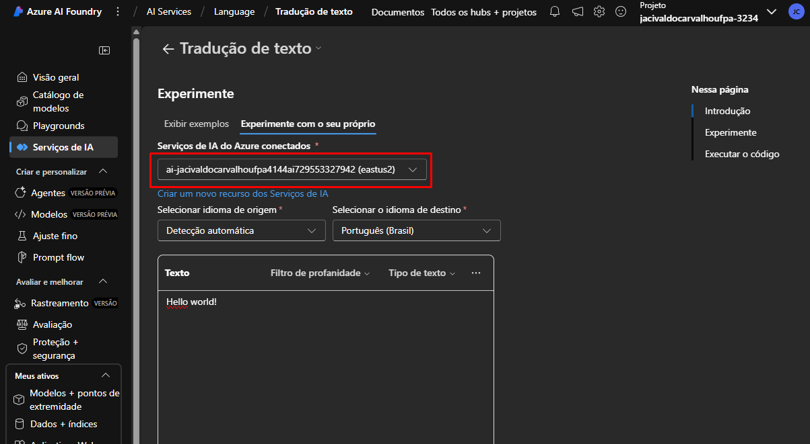
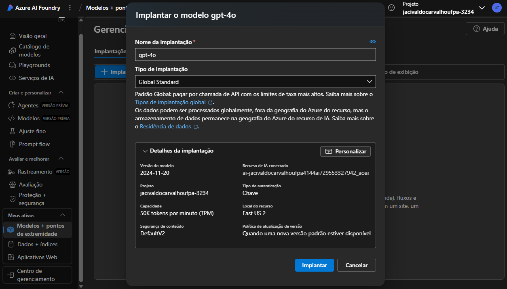
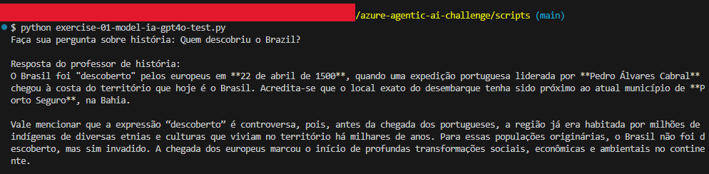

# Prepare-se para um projeto de desenvolvimento de IA com Azure AI Foundry

Este artigo foi projetado para fornecer um passo a passo sobre como utilizar o **Azure AI Foundry** para criar, configurar e explorar soluções de inteligência artificial. Ao seguir este guia, você estará preparado para iniciar seu próprio projeto, configurar hubs e adicionar recursos, como IA do Azure e modelos OpenAI, além de testar e implantar modelos generativos.

## Índice

- [Prepare-se para um projeto de desenvolvimento de IA com Azure AI Foundry](#prepare-se-para-um-projeto-de-desenvolvimento-de-ia-com-azure-ai-foundry)
  - [Índice](#índice)
  - [1. Introdução ao Azure AI Foundry](#1-introdução-ao-azure-ai-foundry)
    - [Acesse o Portal do Azure AI Foundry](#acesse-o-portal-do-azure-ai-foundry)
  - [2. Criação de Hub e Projeto](#2-criação-de-hub-e-projeto)
    - [Criando o Projeto e Hub](#criando-o-projeto-e-hub)
  - [3. Adicionando Recursos](#3-adicionando-recursos)
    - [Passos para Adicionar um Recurso Conectado](#passos-para-adicionar-um-recurso-conectado)
  - [4. Explorando os Serviços de IA do Azure](#4-explorando-os-serviços-de-ia-do-azure)
    - [Testando o Serviço de Tradução de Texto](#testando-o-serviço-de-tradução-de-texto)
  - [5. Implantando e Testando Modelos de IA Generativas](#5-implantando-e-testando-modelos-de-ia-generativas)
    - [Passos para Implantar o Modelo GPT-4o](#passos-para-implantar-o-modelo-gpt-4o)
    - [Teste do Modelo com Código Python](#teste-do-modelo-com-código-python)
  - [6. Resumo e Observações Finais](#6-resumo-e-observações-finais)
  - [7. Referências](#7-referências)


## 1. Introdução ao Azure AI Foundry

O **Azure AI Foundry** oferece uma plataforma robusta e colaborativa onde desenvolvedores e equipes podem criar soluções de IA escaláveis e eficientes. Ao acessar o portal, você poderá criar hubs e projetos, adicionar recursos conectados e explorar modelos generativos como o **GPT-4o** para acelerar seu desenvolvimento.

### Acesse o Portal do Azure AI Foundry
Para iniciar, acesse o portal do [Azure AI Foundry](https://ai.azure.com) e faça login com suas credenciais do Azure. Feche qualquer painel de início rápido ou dicas que apareçam ao fazer login pela primeira vez.

<figure style="text-align: center;">
    
    <figcaption> Portal do Azure AI Foundry.</figcaption>
</figure>


## 2. Criação de Hub e Projeto

O primeiro passo para trabalhar com IA no Azure AI Foundry é criar um **hub** e um **projeto**. O hub serve como um espaço de trabalho colaborativo, enquanto o projeto abrange a solução de IA específica que será desenvolvida.

### Criando o Projeto e Hub

1. Na parte inferior do painel de navegação à esquerda, selecione **Centro de Gerenciamento**.
2. Aqui, você pode definir as configurações do seu hub e projeto, gerenciar usuários e modelos, e visualizar os recursos conectados.

<figure style="text-align: center;">
    
    <figcaption> Central de gerenciamento no Azure AI Foundry.</figcaption>
</figure>


## 3. Adicionando Recursos

Seu projeto pode precisar acessar serviços adicionais do Azure, como **Azure AI Services**. Aqui, você aprenderá como adicionar novos recursos ao seu hub e projeto.

### Passos para Adicionar um Recurso Conectado

1. No portal do Azure, selecione **+ Criar** e busque por **Azure AI Services**.
2. Escolha o recurso multisserviço **Serviços de IA do Azure**.

<figure style="text-align: center;">
    
    <figcaption> Criando recurso no Azure AI Foundry.</figcaption>
</figure>

Após a criação, volte para o **Centro de Gerenciamento** do Azure AI Foundry e acesse a página **Recursos Conectados ou Connected resources** para visualizar os recursos recém-adicionados.

<figure style="text-align: center;">
    
    <figcaption> Novos recursos adicionados no projeto.</figcaption>
</figure>


## 4. Explorando os Serviços de IA do Azure

Agora que seu projeto está configurado com recursos conectados, você pode começar a explorar os **Serviços de IA do Azure**. Um exemplo prático é a funcionalidade de **tradução de texto**.

### Testando o Serviço de Tradução de Texto

1. No portal do Azure, acesse a **Central de Gerenciamento** e selecione **Serviços de IA**.
2. Clique no bloco **Idioma e Tradutor** e acesse a guia de **Tradução**.
3. Teste a tradução de texto, por exemplo, de "Hello World!" para outros idiomas.

<figure style="text-align: center;">
    
    <figcaption> Testando a tradução de texto com o serviço de IA.</figcaption>
</figure>


## 5. Implantando e Testando Modelos de IA Generativas

A implantação de modelos como o **GPT-4o** no seu projeto pode ser feita diretamente pela **Centro de Gerenciamento**. A seguir, você aprenderá como implantar e testar este modelo para realizar tarefas como responder a perguntas de maneira autônoma.

### Passos para Implantar o Modelo GPT-4o

1. No menu à esquerda, acesse **Meus Ativos** e selecione **Modelos + Pontos de extremidade**.
2. Clique em **+ Implantar Modelo** e escolha **GPT-4o**.

<figure style="text-align: center;">
    
    <figcaption> Implantando o modelo GPT-4o no Azure AI Foundry.</figcaption>
</figure>

### Teste do Modelo com Código Python

Após a implantação, você pode testar o modelo utilizando um código simples em Python. O exemplo abaixo permite enviar perguntas sobre história e obter respostas detalhadas:

```python
# Código para interagir com o modelo GPT-4o

import os
from openai import AzureOpenAI
from dotenv import load_dotenv

load_dotenv()

endpoint = os.getenv("AZURE_OPENAI_ENDPOINT")
subscription_key = os.getenv("AZURE_OPENAI_API_KEY")
api_version = "2024-12-01-preview"
deployment = "gpt-4o"

client = AzureOpenAI(api_version=api_version, azure_endpoint=endpoint, api_key=subscription_key)

pergunta = input("Faça sua pergunta sobre história: ")

response = client.chat.completions.create(
    messages=[{"role": "system", "content": "Você é um professor de história."}, {"role": "user", "content": pergunta}],
    max_tokens=4096,
    temperature=1.0,
    top_p=1.0,
    model=deployment
)

print("\nResposta do professor de história:")
print(response.choices[0].message.content)
```

<figure style="text-align: center;">
    
    <figcaption> Testando o modelo GPT-4o com o projeto criado.</figcaption>
</figure>


## 6. Resumo e Observações Finais

Neste exercício, foi explorado o Azure AI Foundry e viu como criar e gerenciar hubs e projetos, adicionar recursos conectados e explorar os serviços de IA do Azure e os modelos do Azure OpenAI no portal do Azure AI Foundry. A seguir, é importante lembrar de **limpar os recursos** para evitar custos adicionais.

> **Observação: Limpeza de Recursos**
>
> Para evitar custos desnecessários, exclua os recursos criados no Azure após a conclusão do exercício. Isso pode ser feito através do portal do Azure, na seção **Grupo de Recursos**, selecionando **Excluir**.


## 7. Referências

- [Prepare for an AI development project](https://microsoftlearning.github.io/mslearn-ai-studio/Instructions/01-Explore-ai-studio.html)
